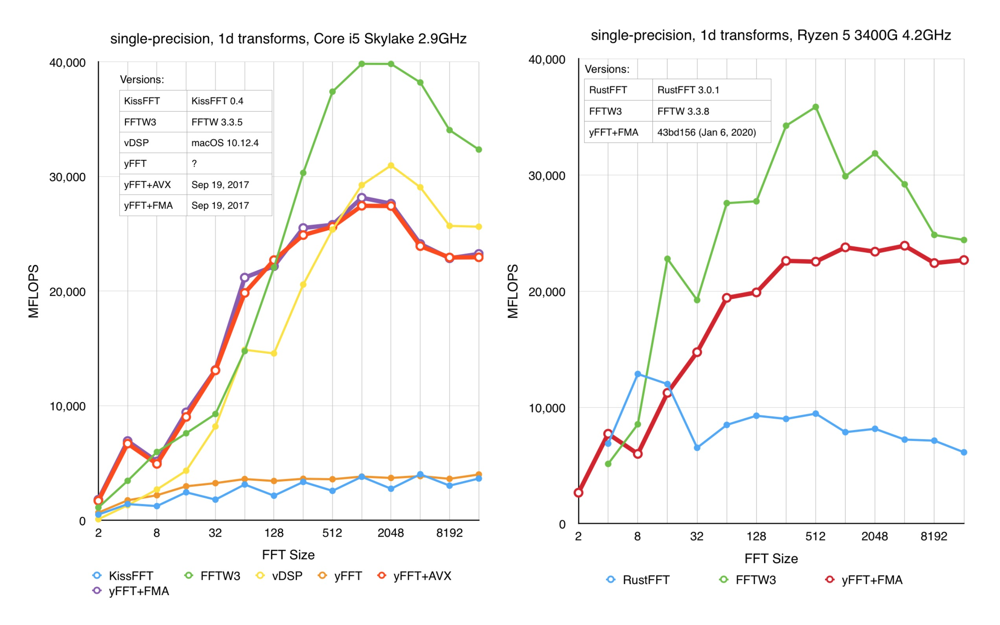

# `yfft`

[](https://docs.rs/yfft/)

Simple FFT library written purely in Rust. Requires a Nightly Rust compiler for x86 intrinsics.



## Features

 - Features moderately optimized FFT kernels for small, power-of-two,
   single precision transforms.
 - Supports real-to-complex and complex-to-real transforms.
 - Clients can opt in to a swizzled input/output data order when they don't
   need naturally-ordered data.

## Limitations

This library was written in 2017 for internal use (specifically, real-time
game audio processing) and is not actively maintained anymore. For this
reason, this library has the following important limitations:

 - It's only optimized for small, power-of-two, single precision transforms.
   It may work for other sizes, but it will use extremely slow code paths.
 - It only supports 1D transforms.
 - It does not support detecting processor features at runtime.
 - The implementation relies on **a plenty of unsafe Rust code**.
   Use at your own risk!

## Notes Regarding Compilation

As of the version 1.19.0 cargo doesn't support passing codegen flags to rustc. Because of this,
you need to pass the following flags via the `RUSTFLAGS` environment variable to enable AVX kernel:

```sh
export RUSTFLAGS='-Ctarget-feature=+avx,+sse3'
```

Note: this causes codegen to generate VEX prefixes to all SSE instructions and makes the binary
incompatible with processors without AVX support.

License: MIT/Apache-2.0
